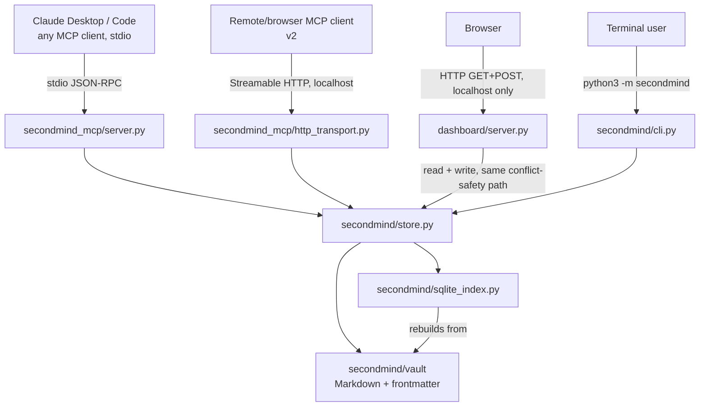
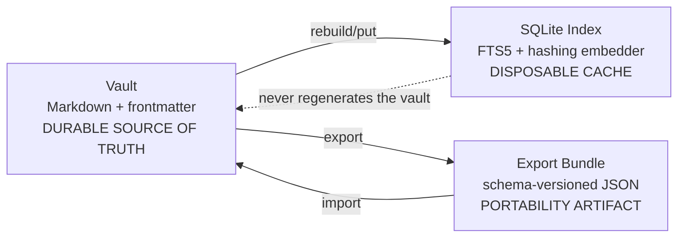
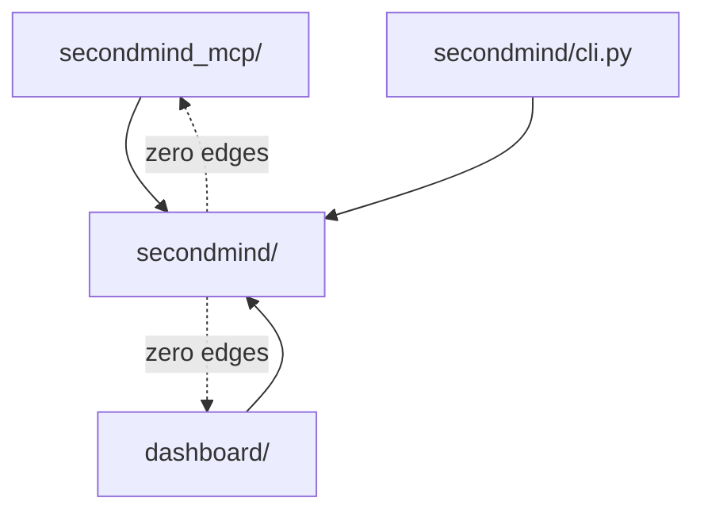
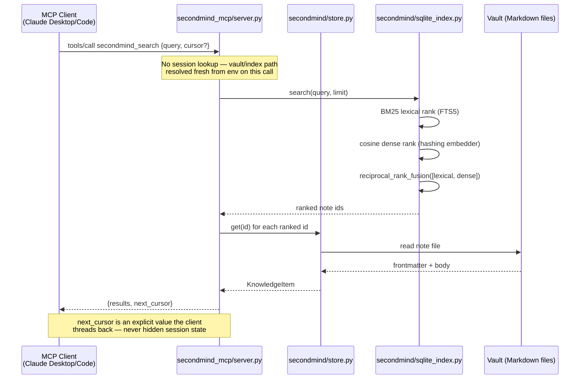

# SecondMind — Architecture

This document is updated whenever a phase changes a system boundary. See [`SPEC.md`](./SPEC.md)
for the full contract; this document is the map of how the pieces connect.

## System context

Four ways to reach SecondMind: an MCP client over stdio (Claude Desktop/Code today; any
MCP-compliant client tomorrow), an MCP client over Streamable HTTP (v2 — a remote or
browser-based client, run separately from the stdio entry), a browser hitting the local
dashboard (v2 — read *and* write, per §11 below), or a terminal user via the CLI. All four
ultimately go through the same core package — there is exactly one source of truth (the vault)
and one derived cache (the SQLite index), never a fork of logic per surface.



**ASCII fallback:**
```
  Claude Desktop/Code   Remote/browser MCP    Browser         Terminal user
        |                  client (v2)          |                  |
   stdio JSON-RPC      Streamable HTTP     HTTP (127.0.0.1)   python3 -m secondmind
        v                    v                  v                  v
  secondmind_mcp/    secondmind_mcp/      dashboard/server.py  secondmind/cli.py
   server.py         http_transport.py         |                    |
        |                    |            read + write               |
        +--------------------+--------------------+------------------>+
                                        v
                              secondmind/store.py
                                  /        \
                                 v          v
                      secondmind/vault   secondmind/sqlite_index.py
                      (Markdown, TRUTH)  (SQLite FTS5, DISPOSABLE CACHE)
                                 ^______________|
                                 index always rebuilds FROM the vault,
                                 never the reverse
```

## Data flow: vault vs. index vs. export bundle



The index rebuilds from the vault; the vault never rebuilds from the index. Deleting the index
file is always safe — the next read triggers a rebuild. Deleting the vault loses data; there is
no other durable copy inside SecondMind itself (git-tracking the vault directory externally,
outside this repo, is the user's own backup strategy).

## Component isolation boundary

`secondmind/` (core) has zero import edges into `secondmind_mcp/` or `dashboard/`. Both of those
depend on the core; the core depends on neither. This is enforced by a CI job that runs the core
test suite in a virtualenv with the `mcp` package deliberately *not* installed — if that job
passes, the boundary is real, not just documented. `secondmind_mcp/http_transport.py` (v2,
Streamable HTTP) is a sibling module inside `secondmind_mcp/` that imports `build_server()` from
`secondmind_mcp/server.py` — it never reaches into the core directly, so it doesn't get its own
box in the diagram below; it inherits the same isolation guarantee through `server.py`.



## Sequence: a `secondmind_search` call end-to-end



Verified end-to-end (not just in-process) by `scripts/live_probe.py`, which spawns the real
server as a real subprocess over real stdio and drives this exact call sequence.

## Stateless MCP boundary (2026-07-28 spec)

Per the current MCP specification, there is no session object anywhere in
`secondmind_mcp/server.py`. Every tool call resolves the vault/index path fresh via
`secondmind.paths` and reads/writes through `secondmind.store`. The one place state crosses a
call boundary is `secondmind_search`'s `cursor` — an opaque value the client stores and replays,
never something the server remembers between calls (the "explicit-handle pattern" from the
spec). Because state was never hidden in a session, the v2 Streamable HTTP transport (below)
was purely additive — no tool-contract change, and it can route each request to a different
server process with zero behavior change, exactly as designed for from v1.

## Packaging: Agent Plugins 1.0.0

```
SecondMind/                      <- the plugin, per agent-plugins.org/specification
├── plugin.json                  <- {"$schema": "...", "name": "secondmind"}
├── mcp.json                     <- declares secondmind_mcp/server.py, "type": "stdio"
├── skills/secondmind/SKILL.md   <- natural-language trigger doc
├── secondmind/                  <- core (this diagram's "CORE")
├── secondmind_mcp/               <- MCP adapter (server.py + http_transport.py, v2)
└── dashboard/                   <- optional web UI (v2: read + write, see §11)
```

Each entry fails independently: if the dashboard is missing or `mcp.json`'s server fails to
start, a compliant client skips that entry and keeps the rest of the plugin working.

---

## v2 additions (see SPEC.md §10-13 and ROADMAP.md for the full contract of each)

The diagrams above already reflect these; this section is the map of *where* each v2 addition
actually lives, for anyone tracing from a feature back to its code.

| Addition | Module | Summary |
|---|---|---|
| `mcp` 2.0.0 port | `secondmind_mcp/server.py` | Constructor `on_list_tools=`/`on_call_tool=` kwargs replace the old decorator API; `MCPError` (renamed from `McpError`) with a new `(code, message, data=None)` constructor; exceptions raised from a tool handler are no longer auto-wrapped into `CallToolResult(is_error=True)` — `_handle_call_tool` catches them explicitly (SPEC.md §10.1). |
| Streamable HTTP transport | `secondmind_mcp/http_transport.py` | Additive over stdio — same 8 tools, same contracts, only the wire transport differs. Stateless (`stateless_http=True`), bound to `127.0.0.1`, DNS-rebinding protection active. Run via `scripts/run_http_server.py`, separately from the stdio entry `mcp.json` declares (SPEC.md §11). |
| TTL pruning | `secondmind/prune.py` | `secondmind_prune` tool / `secondmind prune` CLI command — deletes notes past their `ttl_days` expiry, dry-run supported. |
| Vault migration | `secondmind/migrate.py` | Adapts any external directory of `.md` + YAML-subset frontmatter into the export-bundle shape, then reuses the already-tested `import_bundle()` — sanitizes ids, defaults missing fields, skips malformed files rather than aborting (SPEC.md §12). |
| Session reflection | `secondmind/reflection.py` | `secondmind_get_recent` — pure data retrieval (most-recently-updated notes), zero LLM dependency. The calling AI, not the server, decides what's worth summarizing (SPEC.md §13's design correction after real spec research ruled out server-initiated sampling). |
| Optional semantic embedder | `secondmind/semantic_embedder.py` | `secondmind[semantic]` extra, lazy-imported inside a function so the core still imports cleanly with the extra absent; falls back to `HashingEmbedder` silently if missing or the model fails to load. Never installed or downloaded by default. |
| Dashboard write endpoints | `dashboard/server.py` | `POST /api/put` / `POST /api/supersede/<id>` — routed through the exact same `VaultStore.put`/`supersede` conflict-safety path the CLI and MCP adapter use, never a separate write implementation. Plus `GET /api/settings` (vault/index path, note count) backing the dashboard's settings panel. |

**Tool count**: 8 total (`secondmind_put`, `_get`, `_search`, `_list`, `_export`, `_import`,
`_prune`, `_get_recent`) — the sequence diagram above shows `secondmind_search` as one
representative call; all 8 follow the same stateless, explicit-handle design.
