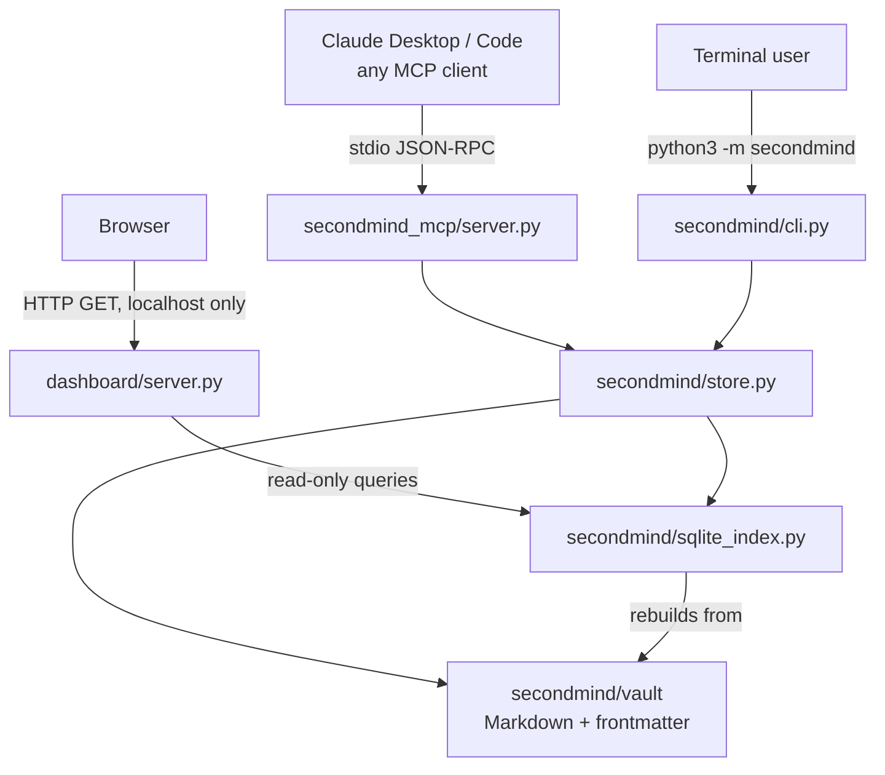
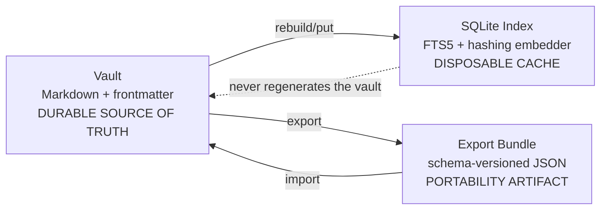
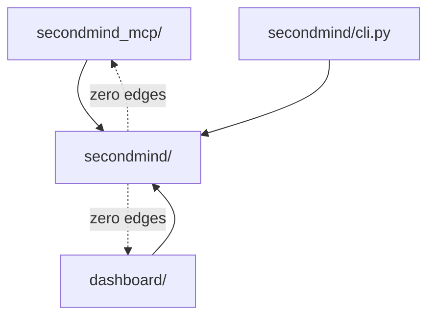
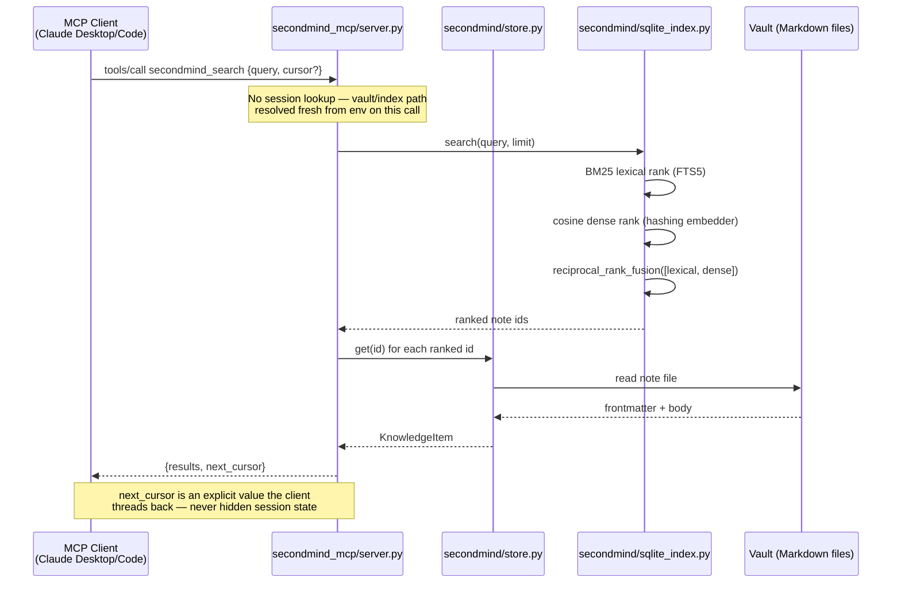

# SecondMind — Architecture

This document is updated whenever a phase changes a system boundary. See [`SPEC.md`](./SPEC.md)
for the full contract; this document is the map of how the pieces connect.

## System context

Three ways to reach SecondMind: an MCP client (Claude Desktop/Code today; any MCP-compliant
client tomorrow), a browser hitting the local read-only dashboard, or a terminal user via the
CLI. All three ultimately go through the same core package — there is exactly one source of
truth (the vault) and one derived cache (the SQLite index), never a fork of logic per surface.



**ASCII fallback:**
```
  Claude Desktop/Code        Browser              Terminal user
        |                      |                       |
   stdio JSON-RPC         HTTP (127.0.0.1)        python3 -m secondmind
        v                      v                       v
  secondmind_mcp/         dashboard/server.py      secondmind/cli.py
   server.py                   |                        |
        |                read-only queries               |
        +---------------------+------------------------->+
                              v
                     secondmind/store.py
                          /        \
                         v          v
              secondmind/vault   secondmind/sqlite_index.py
              (Markdown, TRUTH)  (SQLite FTS5, DISPOSABLE CACHE)
                         ^______________|
                         index always rebuilds FROM the vault,
                         never the reverse
```

## Data flow: vault vs. index vs. export bundle



The index rebuilds from the vault; the vault never rebuilds from the index. Deleting the index
file is always safe — the next read triggers a rebuild. Deleting the vault loses data; there is
no other durable copy inside SecondMind itself (git-tracking the vault directory externally,
outside this repo, is the user's own backup strategy).

## Component isolation boundary

`secondmind/` (core) has zero import edges into `secondmind_mcp/` or `dashboard/`. Both of those
depend on the core; the core depends on neither. This is enforced by a CI job that runs the core
test suite in a virtualenv with the `mcp` package deliberately *not* installed — if that job
passes, the boundary is real, not just documented.



## Sequence: a `secondmind_search` call end-to-end



Verified end-to-end (not just in-process) by `scripts/live_probe.py`, which spawns the real
server as a real subprocess over real stdio and drives this exact call sequence.

## Stateless MCP boundary (2026-07-28 spec)

Per the current MCP specification, there is no session object anywhere in
`secondmind_mcp/server.py`. Every tool call resolves the vault/index path fresh via
`secondmind.paths` and reads/writes through `secondmind.store`. The one place state crosses a
call boundary is `secondmind_search`'s `cursor` — an opaque value the client stores and replays,
never something the server remembers between calls (the "explicit-handle pattern" from the
spec). This means any future Streamable HTTP transport can route each request to a different
server process with zero behavior change.

## Packaging: Agent Plugins 1.0.0

```
SecondMind/                      <- the plugin, per agent-plugins.org/specification
├── plugin.json                  <- {"$schema": "...", "name": "secondmind"}
├── mcp.json                     <- declares secondmind_mcp/server.py, "type": "stdio"
├── skills/secondmind/SKILL.md   <- natural-language trigger doc
├── secondmind/                  <- core (this diagram's "CORE")
├── secondmind_mcp/               <- MCP adapter
└── dashboard/                   <- optional read-only web UI
```

Each entry fails independently: if the dashboard is missing or `mcp.json`'s server fails to
start, a compliant client skips that entry and keeps the rest of the plugin working.
